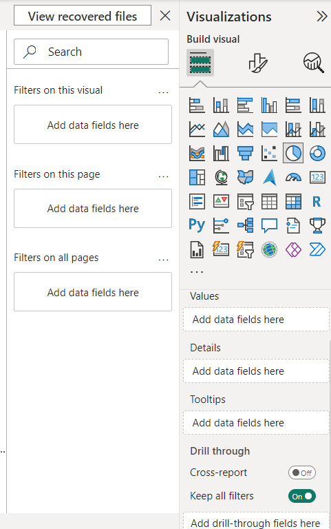

First make and fix the requirements that you are needed for the project 

Make a List of Requirements Before Visulization 

There are various Axis Based on the types of the Data Visuals Types 
1. Bar Chart -- x,y axis 
2. Pie Chart -- Many Axis 
   

OPtions, FOnt Size, Alignment, 

Also There is types of bar chart --- We Can Customize it -- Based on the Scenarious 

Card --> To display Main Things or any individual important thing

Slicer --- > To sort 

TABLE -- > Not able to do + - in the dataset 

Matrix --> Able to + - in the dataset to view elaborate

