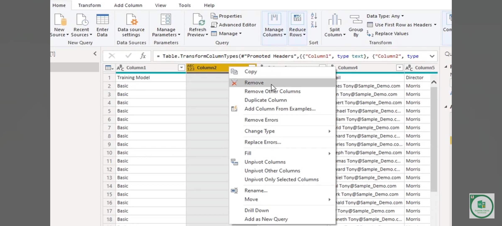
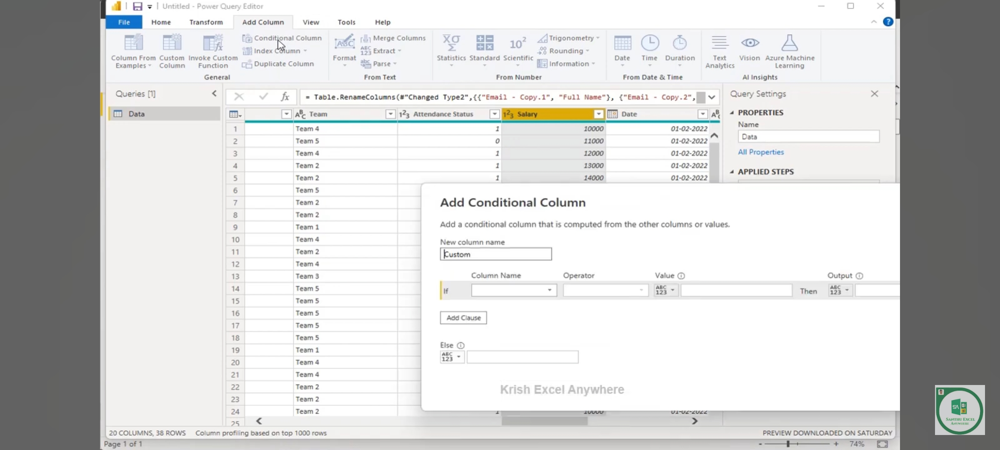

unstructed Data --> Structured Data --- > Data Transformation

**Transform Data:**

Remove Columns and Rows
Replace Null Values
Use First Row as Header
Split function
Change Data Type
Rename Column Headings
Conditional Column

**Tasks above**

Note: If the raw Data is Always Messy --- > Try to use the Power Bi transform --> Once Configured --> It is Applied automatically

To remove col -- > Right click and then remove in query Editor

  

To Replace with zero
right click the value and then Click Replace

To blank value ---> give blank space

Duplicate a Column --- Split Column --> Delimter --> etc ....

Rename a Columns of the duplicate 

Make a condition Column---> Add Column --> Conditional Col--> Sort and give result

