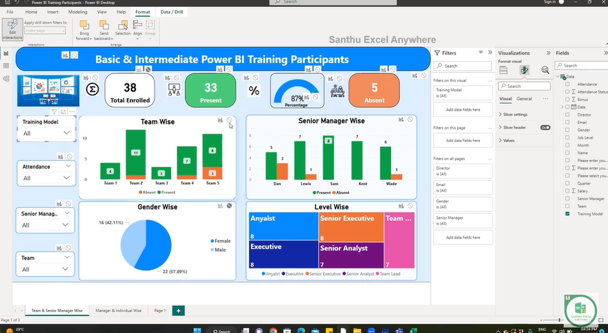

# Edit Visuals in Power BI

Power BI provides a range of options to customize and enhance visuals in your reports. By editing visuals, you can tailor their appearance, behavior, and data representation to meet your specific requirements. Here are some key steps to edit visuals in Power BI:

1. Select the visual you want to edit: Click on the visual in your report canvas to activate it for editing.

2. Access the Visualizations pane: On the right side of the Power BI window, click on the "Visualizations" icon to open the Visualizations pane.

3. Customize visual properties: In the Visualizations pane, you can modify various properties of the selected visual, such as data fields, formatting options, and interaction behavior. Experiment with different settings to achieve the desired look and functionality.

4. Apply filters and slicers: Use the Filters and Slicers panes to apply filters and slicers to your visual. This allows you to focus on specific data subsets or dimensions.

5. Use the Format pane: The Format pane provides additional options to fine-tune the appearance of your visual. You can adjust colors, fonts, labels, and other visual elements to match your design preferences.

6. Preview and refine: As you make changes, use the "Preview" button to see how your visual looks in real-time. Refine your edits until you are satisfied with the result.

7. Save and share: Once you have finished editing the visual, save your report and share it with others. You can publish it to the Power BI service or export it in various formats for distribution.

Remember, the editing capabilities in Power BI are extensive, allowing you to create visually appealing and interactive reports. Experiment with different options to unleash the full potential of your data visualizations.

Go to format --> Edit Interaction -->

