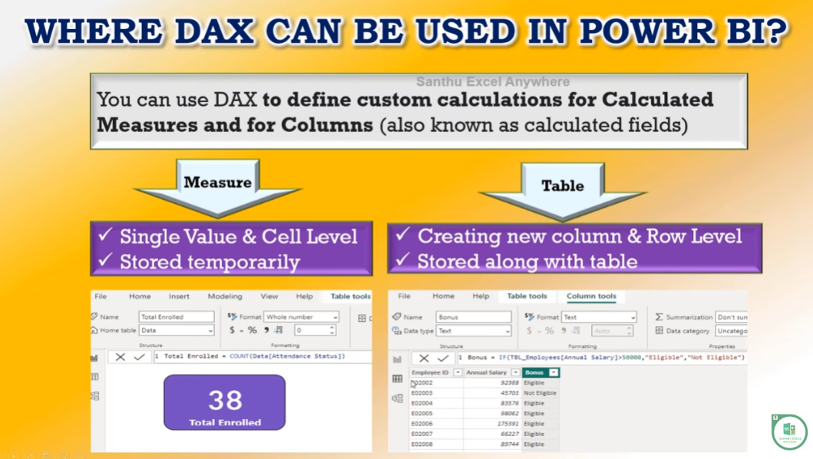
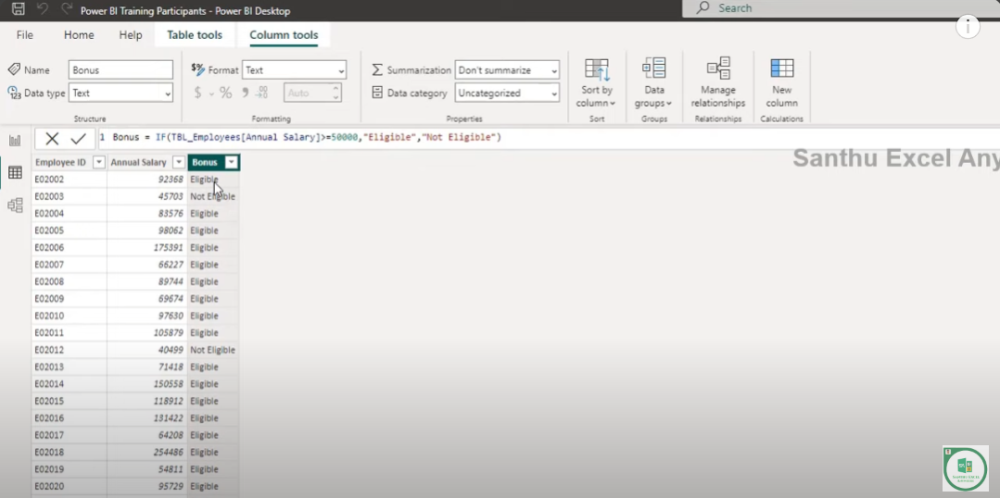

Excel ---> Excel Formula

Power BI --> DAX  --> Data Analytics Expression --> It is a formal Language and it is also known as library of function language where the full code is kept inside a function

For What DAX is used 

DAX to define custom calculations for Calculated Measures and for columns 

There are two ways of using DAX 
1. Measure - Summarize the data to a single value
2. Table - For indidual Analysis

