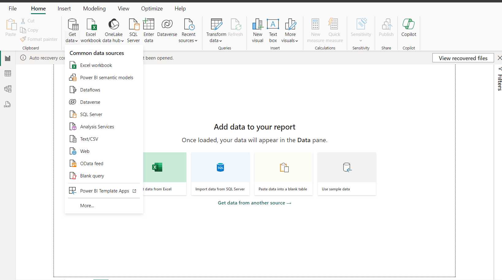
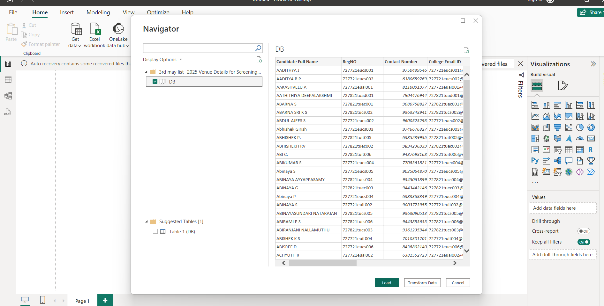

importing of the data and the challenges that we face are 

Mostly Used ---> Excel, Sql, CSV

To remove or clean or to change the unwanted Data -- > Use Data Transform 

Power Bi has Its own Date Hierarchy --> You Can Sort by using Date, Day, Month, Year etc .
In Excel You need to use Date Formulas to Sort 
